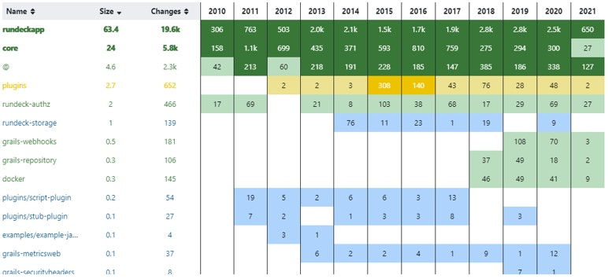
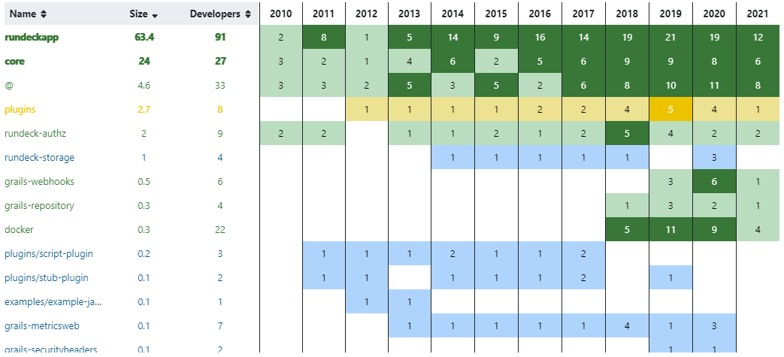
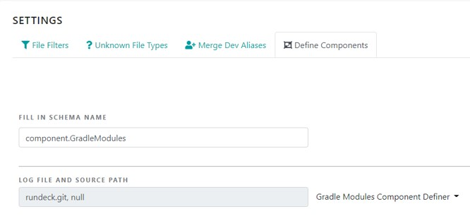

# Gradle Modules Component Definer
This plugin enables the user to split a Gradle-based project into its distinct modules.

## Motivation
Our plugin is meant to facilitate the better understanding of the evolution of each and every module inside a Gradle project, as well as the evolution of the system as a whole. It is developed as a plugin for Dx-Platform, a software risk and quality assesment platform designed for analyzing GitHub repositories.

## Screenshots
Evolution of the modules through changes: the workflow

Evolution of the modules through developers: how the knowledge is shared

## Used Technology
- Programming Language: Java
- Compiled with: OpenJDK version 11 
- IDE: IntelliJ IDEA
- Build Platform: Maven

## Features
By splitting a project into its distinct modules, the user is able to observe the workflow inside the project, how the knowledge is shared between developers, which files are possible Bug Magnets or might cause anomalies. Being aware of the previous facts enables the user to make competent and knowledge-based decisions about the further development of the project.

## Installation
First of all you should download the binaries from the latest release of Gradle Component Definer found at: https://github.com/RaduBogdan98/CES_Plugin/releases/tag/v1.0.0.

1. Usage for Dx-Platform
   - set up Dx-Platform on your computer as indicated by the authors;
   - copy the GradleComponentDefiner folder from the binaries archive to the plugins folder in .dx-platform;
   - open Dx-Platform and create a new project as follows:
      - provide a project ID, name and description;
      - provide an input source for the project you want to analyze: a log file or an URL to a GitHub repository;
      - for generating the log file use the following commands:

        `git log --encoding=UTF-8 --no-merges --find-renames --numstat --raw --format="commit:%H%nauthor:%an%nemail:%ae%ndate:%cD%nmessage:%n%s%n%b%nnumstat:" > proj_name.git` (for LINUX / Mac OS)

        `git log --encoding=UTF-8 --no-merges --find-renames --numstat --raw --format="commit:%H%nauthor:%an%nemail:%ae%ndate:%cD %nmessage:%n%s%n%b%nnumstat:" > proj_name.git` (for Windows)

   - the plugin is automatically detected by the platform;
   - create a component schema based on our plugin as follows:
     - go to the "Define Components" section inside Configure;
     - click "Add new schema" and choose "Add by schema recipe" from the drop-down;
     - fill the schema name and choose our plugin from the drop-down as shown in the following image:
     
     - click on "Create" button and reload the page.

2. Standalone usage with Docker
   - open a terminal or cmd inside DockerGradleComponentDefiner folder in the binaries archive;
   - run the following command:

     `sudo docker run -v $PWD/:/gradleComponentDefiner/files iulius98/gradle-component-definer files/components.json files/sample_filesToGroup.txt` (for LINUX / Mac OS)

     `docker run -v $PWD/:/gradleComponentDefiner/files iulius98/gradle-component-definer files/components.json files/sample_filesToGroup.txt` (for Windows PowerShell)

     `docker run -v %cd%/:/gradleComponentDefiner/files iulius98/gradle-component-definer files/components.json files/sample_filesToGroup.txt` (for Windows cmd)

   - the components.json file will appear inside the folder.

## Aknowledgements
We thank the developers of Dx-Platform for letting us use their product in order to have a better visual grip on the outcome of our project.

## License
Copyright 2020 Radu Cotișel, Iulia Teodorescu

Licensed under the MIT License. You may not use this file except in compliance with the License.

Software distributed under the License is distributed on an "AS IF" BASIS, WITHOUT WARRANTIES OF ANY KIND, either express or implied. See the License for the specific language governing permissions and limitations under the License.